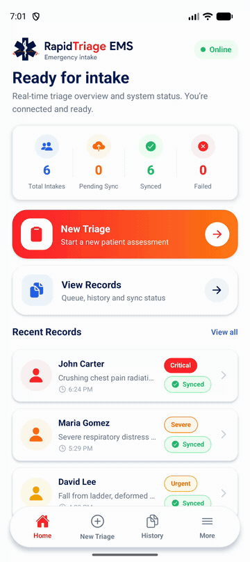
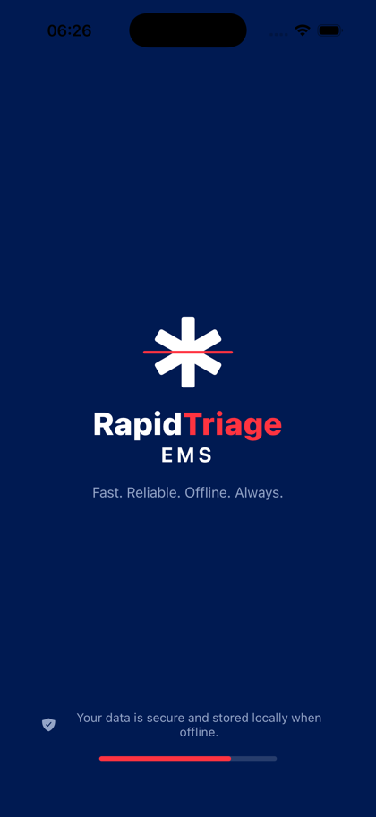
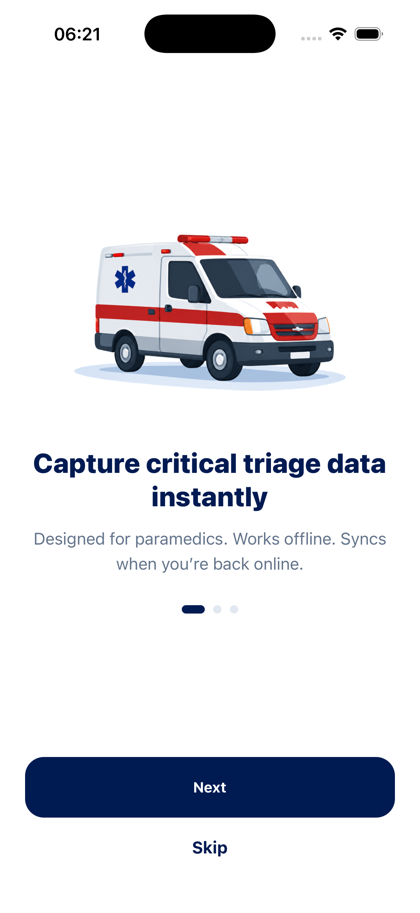
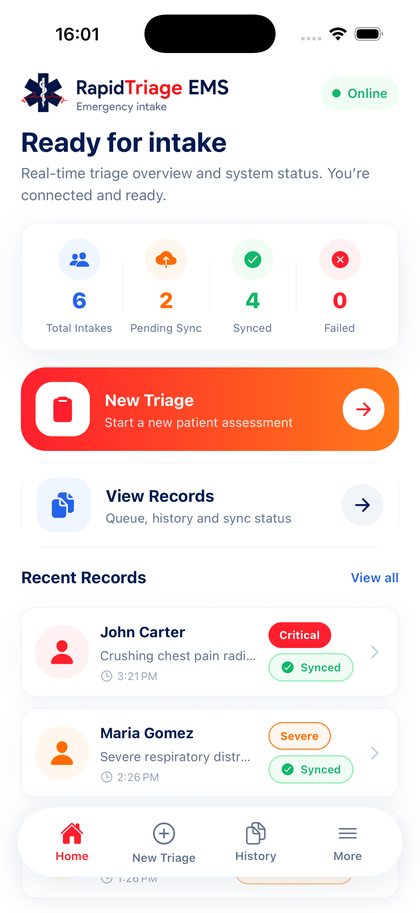
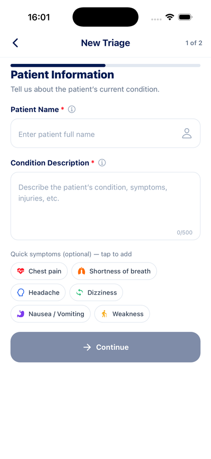
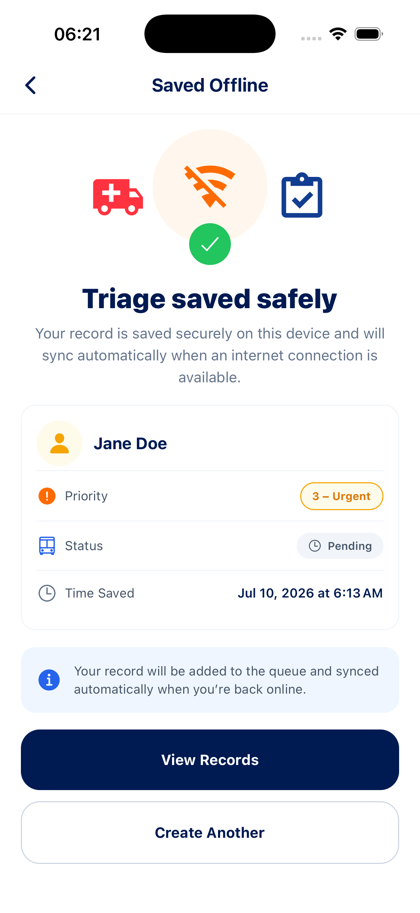
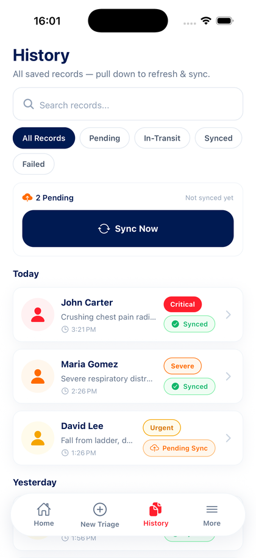
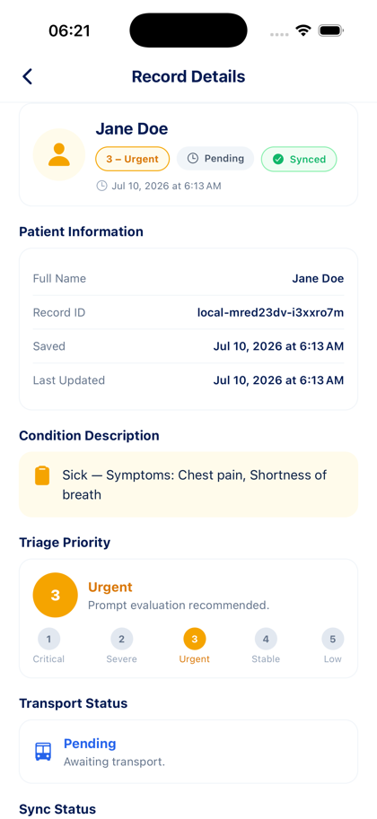
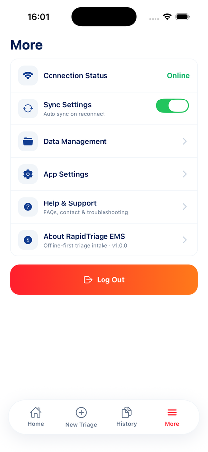

# RapidTriage EMS

A resilient, offline-first triage intake app for field paramedics. It lets a responder capture a patient record in a few taps and guarantees that record survives even with no signal, then syncs to the backend on its own the moment the phone is back online.

Built with React Native and Expo (TypeScript). The backend API and Postgres database are deployed and running on Render.

- **Repository:** https://github.com/Ericokim/rapidtriage-ems
- **Live API:** https://rapidtriage-api.onrender.com/health
- **Android APK:** [download and install](https://expo.dev/artifacts/eas/eyH3-wZlwemtlOLdFdThJwSthFIlhnImzTdskYOQUKM.apk)

## Demo

<p align="center">
  
</p>

A quick run through the app: launch and onboarding, the dashboard, capturing a triage, the local-save confirmation, the records history with live sync status, a record detail, and settings. Records land in on-device storage first, and anything pending uploads by itself once the connection comes back. Pulling down to refresh re-checks connectivity and drains the queue on demand.

## Screenshots

| Splash | Onboarding | Home |
| :---: | :---: | :---: |
|  |  |  |
| **New Triage** | **Saved (offline)** | **History and sync** |
|  |  |  |
| **Record detail** | **Settings** | |
|  |  | |

## The problem this solves

Paramedics work where coverage is patchy or gone. They cannot stop to worry about whether a form submitted. The whole app is built around one rule:

> A valid triage record must never be lost to a network failure.

Every design choice follows from that. The device is the source of truth while a responder is in the field. The server is where records converge once there is a connection to spare.

## How it works

### Capturing a record

The intake flow collects the four required fields with validation at every step:

- **Patient Name** and **Condition Description** (cannot be blank)
- **Priority Level** 1 to 5, where 1 is life-threatening. Priority 1 and 2 are colour-coded in deep red and orange so critical cases stand out at a glance
- **Status**: Pending or In-Transit

The form is a short two-step flow (patient info, then triage details with a review) so a responder can move through it fast with one thumb. There are quick-tap symptom chips, inline errors, focus highlighting, and per-field hints. You cannot submit until priority and status are chosen.

### The offline-first sync engine

This is the heart of the app. Submitting never talks to the network first.

1. The record is validated with a shared Zod schema.
2. It is written to on-device SQLite immediately and marked `pending`. This happens before any API call, so a dropped connection can never lose it.
3. The UI confirms the save right away. If the phone is offline, the record simply stays queued and the confirmation says so, calmly, with no error screen.
4. When the device is online, a background sync worker picks up the pending records, marks them `syncing`, and batch-uploads them to the API. Successful ones become `synced`; failures stay on the device as `failed` and retry later. Nothing is ever deleted.

The worker is triggered three ways, and it never blocks the interface:

- **Reconnect.** NetInfo watches connectivity. The instant the device goes from offline to online, the queue drains automatically.
- **Foreground.** AppState watches the lifecycle. When the app returns from the background, it re-checks the network and syncs if it can. This keeps the worker predictable across minimise and resume.
- **Pull to refresh.** Dragging down on the home or history screen forces a fresh connectivity check, reloads local data, and pushes the queue. This is the manual escape hatch.

A concurrency guard ensures only one sync run happens at a time. If a second trigger fires mid-run, it joins the in-flight run instead of starting a competing upload, so records are never double-sent.

### Sync status lifecycle

```
pending  ->  syncing  ->  synced
   ^            |
   |            v
   +--------- failed  (retried on the next trigger)
```

Each local record carries its `sync_status`, a `retry_count`, the last error, and timestamps, so the queue and history screens can show exactly where every record stands.

### Idempotent server

The device generates a local id before it ever syncs. The server stores that as `client_id` with a unique constraint and upserts on it. Re-sending the same record updates the existing row instead of creating a duplicate, so retries are always safe.

## Meeting the assessment requirements

| Requirement | How it is met |
| --- | --- |
| Intake form: Name, Condition, Priority 1-5, Status (Pending / In-Transit) | All four fields, typed and validated |
| Validation (no blanks, priority must be selected) | Inline validation with Zod; submit is disabled until valid |
| Priority 1 and 2 stand out with hazard colours | Priority 1 deep red, Priority 2 orange, used on chips, badges and avatars |
| Offline interception, no failure or generic error | Submit writes locally first; offline shows a reassuring "saved" screen |
| Local persistence | Expo SQLite with Drizzle for type-safe SQL |
| Background sync queue, auto-upload on reconnect, non-blocking | Sync engine driven by NetInfo, runs off the UI thread's critical path |
| Production-grade state management | React Context for app state, kept separate from persistence and sync |
| UI decoupled from persistence and sync | Screens call hooks only; a repository owns SQLite, an engine owns sync |
| Device lifecycle handling | AppState re-checks and syncs on foreground |
| Unit tests | 34 tests across shared validation, the API, and the mobile logic and form |
| Public GitHub repo | https://github.com/Ericokim/rapidtriage-ems |
| Backend (a mock was allowed) | A real Express + Postgres API, deployed live on Render |

## Architecture

The app is a small monorepo with a clean separation between what the user sees, where data is stored, and how it syncs.

```
UI screens
  -> hooks (useSync, useNetworkStatus)
  -> SyncProvider (React Context: records, online state, submit, sync)
  -> triage repository (all SQLite reads and writes)  |  sync engine (queue, retries, upload)
  -> shared Zod schema + types (used by both app and API)
  -> Express API
  -> Postgres
```

- **The UI never touches SQL or the network.** Screens render data and call hooks. That is the entire contract.
- **The repository owns persistence.** Every insert, query, and status change goes through it, over a small interface that is backed by SQLite on device and by an in-memory store in tests.
- **The sync engine owns the queue.** It reads pending and failed records, drives the status transitions, calls the API, and guards against concurrent runs. It has no idea what a screen looks like.
- **The shared package owns the contract.** One Zod schema and one set of types validate both the mobile form and the API request, so the two sides can never drift.

Both databases are SQL. SQLite locally, Postgres remotely, Drizzle for type-safe access on both. Keeping the same shape end to end makes the whole thing easy to reason about.

## Tech stack

**Mobile:** React Native, Expo (SDK 54), Expo Router, TypeScript, NativeWind, Expo SQLite, Drizzle ORM, TanStack Query, React Hook Form, Zod, NetInfo, React Context.

**Backend:** Node, Express, PostgreSQL, Drizzle ORM, Zod.

**Shared:** TypeScript types, Zod schemas, and triage constants used by both sides.

**Testing:** Jest and React Native Testing Library for units, Supertest for the API, Playwright for end-to-end on the web build.

## Project structure

```
rapidtriage-ems/
  apps/
    mobile/            Expo app (screens in app/, logic in src/)
    api/               Express + Postgres sync API (4 source files)
  packages/
    shared/            Zod schemas, types, constants
  test/                Playwright end-to-end suite
  docs/                screenshots and demo gif
  render.yaml          Render blueprint (API + Postgres)
  Dockerfile           container build for the API
```

## Running it locally

You need Node 20+, npm, PostgreSQL, and an iOS simulator, Android emulator, or a phone with Expo Go.

```bash
npm install
npm run build:shared

# create the database and env files
createdb rapidtriage
cp apps/api/.env.example apps/api/.env       # set DATABASE_URL
cp apps/mobile/.env.example apps/mobile/.env # EXPO_PUBLIC_API_URL
npm --workspace apps/api run db:migrate
```

Then start everything with one command:

```bash
npm run dev:ios       # shared watcher + API + Expo, opens the iOS simulator
npm run dev:android   # same, Android emulator
npm run dev           # bundler + API only, open a device yourself
```

Metro serves the JavaScript; the app itself runs in a simulator, emulator, or Expo Go, not a browser. On a physical device, point `EXPO_PUBLIC_API_URL` at your machine's LAN IP instead of localhost.

## Testing

```bash
npm test              # all 34 unit and integration tests
npm run typecheck     # all workspaces
npm run lint

# end-to-end (drives the web build in a real browser)
npx playwright install chromium
npm run test:e2e
```

Unit tests live next to the code they cover so each runs in its right environment: the mobile suite under `jest-expo`, the API under node with Supertest, the shared schema under ts-jest. The Playwright suite in `test/` walks the full capture flow. See `test/README.md` for the breakdown.

## The demo the assessment asks for

The short walkthrough is the GIF at the top. To record the required 60-second Airplane-Mode clip:

1. Open the app, show the Online status on the home header.
2. Turn on Airplane Mode.
3. Create a triage (John Kamau, chest pain, Priority 1, In-Transit) and submit.
4. Show the "saved offline" confirmation and the pending record in History.
5. Turn Airplane Mode off.
6. Watch the record flip to Synced on its own, with the UI still responsive.

## Deployment

The backend runs on Render and the app is built with EAS.

**API and database.** The `render.yaml` blueprint provisions a Postgres database and the web service, wires `DATABASE_URL`, builds the API, and runs it. The server applies its Drizzle migrations on boot, so a fresh database is ready with no manual step. Push to GitHub, then in Render pick New, Blueprint, and this repo. The only environment variable the API needs is `DATABASE_URL`; the host provides `PORT`.

**Mobile.** `eas.json` defines the build profiles. The API URL is baked in per profile through `EXPO_PUBLIC_API_URL`.

```bash
npm install -g eas-cli
eas login
cd apps/mobile
eas init
eas build -p android --profile preview   # produces a shareable APK link
```

Nothing secret is committed. `DATABASE_URL` lives only in the host's environment, and `EXPO_PUBLIC_API_URL` is public by design since it is baked into the client.

## Decisions and trade-offs

- **SQLite locally, Postgres remotely.** A triage record is structured and relational, so SQL fits better than a document store, and keeping the same shape on both ends keeps the mental model simple.
- **Drizzle on both sides.** Type-safe SQL without a heavy ORM, and it works against Expo SQLite and Postgres.
- **Context over Redux.** The durable data already lives in SQLite and server state is handled by the API layer, so a third global store would be weight without benefit. Context carries the small amount of UI and connectivity state.
- **A real backend instead of a mock.** The brief allowed a mock repository, but a deployed Express and Postgres service proves the sync path end to end against a live database.
- **A two-step form.** The intake is split into patient info and triage details with a review, which keeps each screen short and thumb-friendly under pressure while still capturing everything in one continuous flow.

